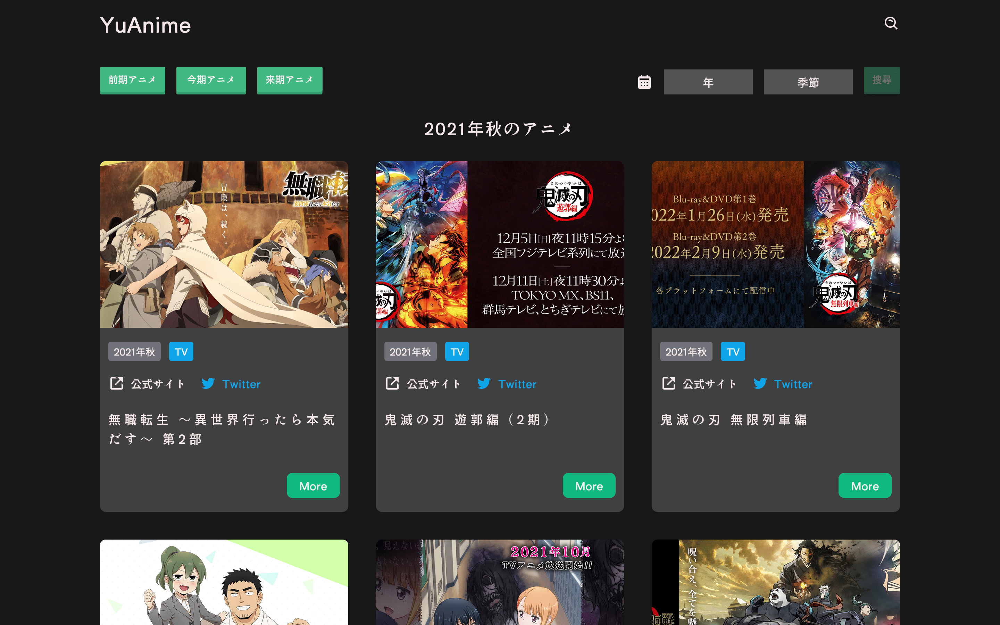
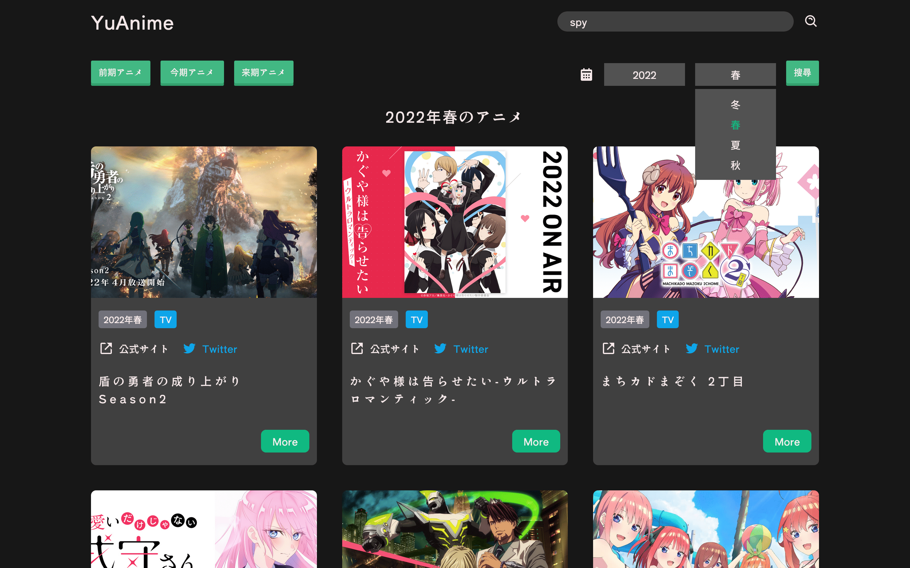
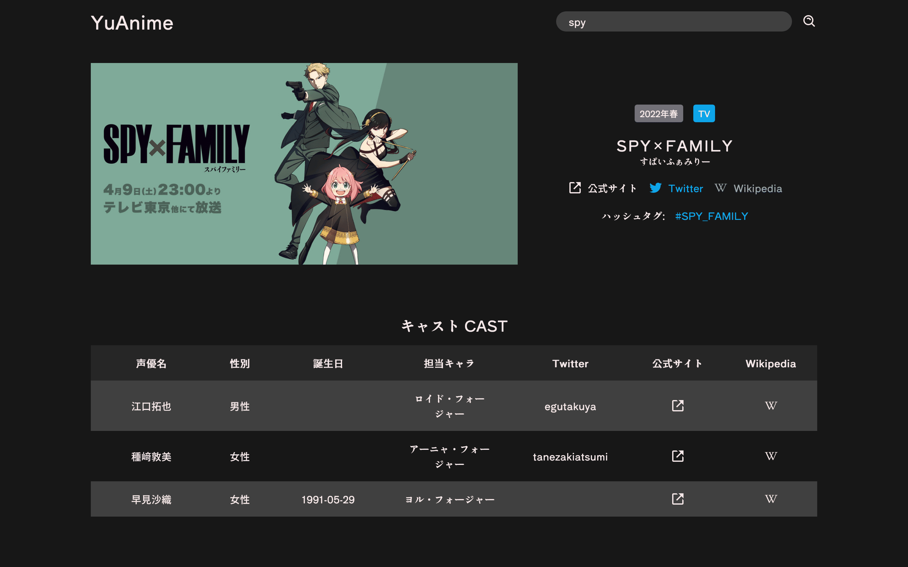
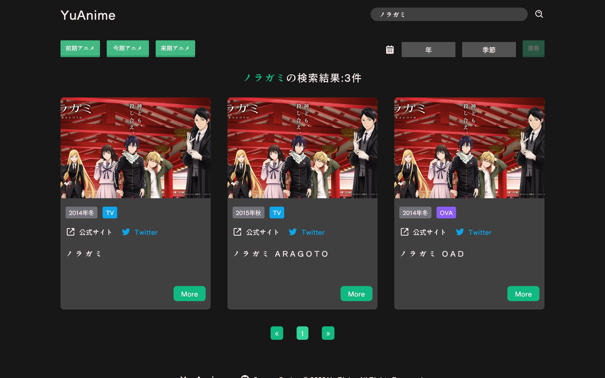
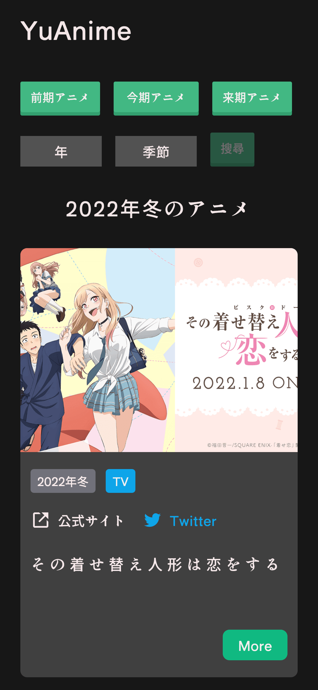
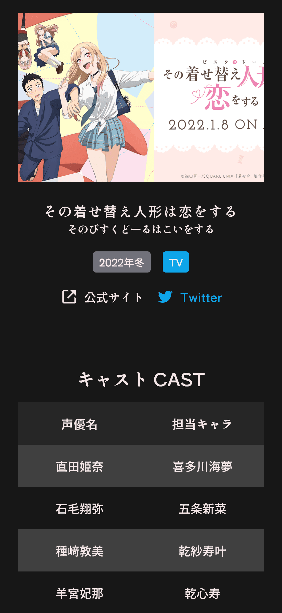

 
  

&#xa0;

  <h1>YuAnime</h1>
  
依照動畫季度快速查詢動畫相關最新情報

  <a href="https://yu-anime.vercel.app/">Demo</a>

&#xa0;

  

  

  

  

  <a href="#dart-about">About</a> &#xa0; | &#xa0; 
  <a href="#sparkles-features">Features</a> &#xa0; | &#xa0;
  <a href="#rocket-technologies">Technologies</a> &#xa0; | &#xa0;
  <a href="#art-layout">Layout</a> &#xa0; | &#xa0;
  <a href="#books-learn">Learn</a>

 

## :dart: About

**YuAnime**的啟發是由於在思考如何設計自己專案樣式時，時常會藉由觀看動畫官網的視覺設計來獲得靈感，並且自己也有追動畫的習慣，想說不如就自己建一個動畫資料查詢網站，於是藉由<a href="https://developers.annict.com/" target="_blank">Annict</a>提供的 API，一個彙整動畫官網、Twitter、聲優等相關資料的網站 YuAnime 就此誕生。

## :sparkles: Features

:heavy_check_mark: 可依照動畫季度搜尋動畫
:heavy_check_mark: 可依照動畫名搜尋動畫
:heavy_check_mark: 動畫詳情頁彙整了所查詢動畫的官網、Twitter、聲優、工作人員等資訊

## :rocket: Technologies

### 使用技術

**Front End**

- [Vue3 Compostion API](https://vuejs.org/guide/introduction.html)
- [Pinia](https://pinia.vuejs.org/)
- [Vue-Router](https://router.vuejs.org/)
- [Tailwind CSS](https://tailwindcss.com/)

## :art: Layout

#### Works

#### Work Detail

#### Search

#### Mobile

  
  
  

## :books: Learn

#### 收穫

1. 更加熟習如何使用 Vue `Composition API`、`TailwindCSS`。
2. 使用 Vue 官方推薦狀態管理套件`Pinia`，對於一般的小專案來說相較於`Vuex`我想使用`Pinia`會更方便許多，移除了`Vuex`中稍嫌繁瑣的`Mutation`階段改為僅有`state`、`getter`、`action`三階段，且分別對應 option API 中的`data`、`computed`、`method`三個觀念用起來更直覺，另外也提供了許多直接操作`state`的 API 與訂閱 store 等特性，使用起來確實更輕巧更方便。
3. 由於動畫資料不是一次性全部 fetch 下來存於全局狀態管理中，而是透過 query 來指定要的資料，為了讓每次 fetch 資料時能有更好的畫面呈現與使用者體驗，製作了組件的`Skeleton`讓資料尚未載入完畢時也能有骨架支撐版面，減少畫面大幅變動。

#### 反思

1. 雖然此次使用了`Pinia`來管理狀態，但此次的專案規模不大，大多數的資料也都不會有過於複雜的組件間流動甚至只需自己使用，把一些局部資料也存於`Pinia`確實是稍嫌不適當，希望隨著經驗的累積能更加規劃區別好局部與全局的狀態劃分。
2. 有別於另一個專案<a href="https://yustory-ded59.firebaseapp.com/" target="_blank">YUSTORY</a>是初次就載入所有資料，這次 YuAnime 的資料是按需載入，對於資料的處理邏輯與分頁功能是此次花費最多的部分，最終使用`onBeforeRouteUpdate`來達成每次 query 變更時再次 fetch 新的資料，並且透過`Skeleton`防止等待資料時畫面布局空洞的問題。

---

更多細節歡迎參觀:<a href="https://yu-anime.vercel.app/" target="_blank">YuAnime</a>

Made by <a href="https://github.com/yuRicky09" 
target="_blank">yuRicky09</a>

<a href="#top">Back to top</a>
